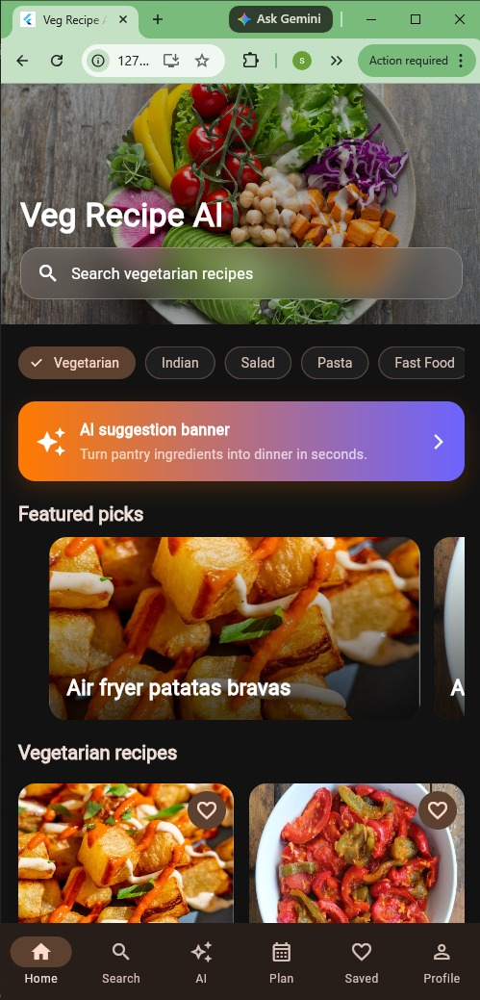
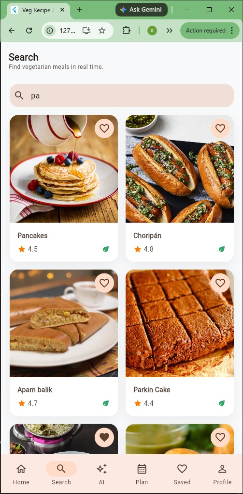
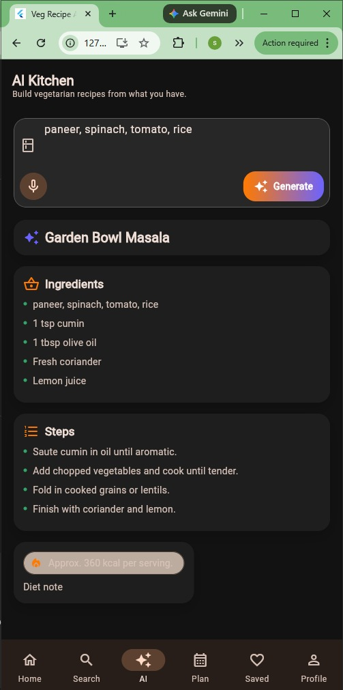
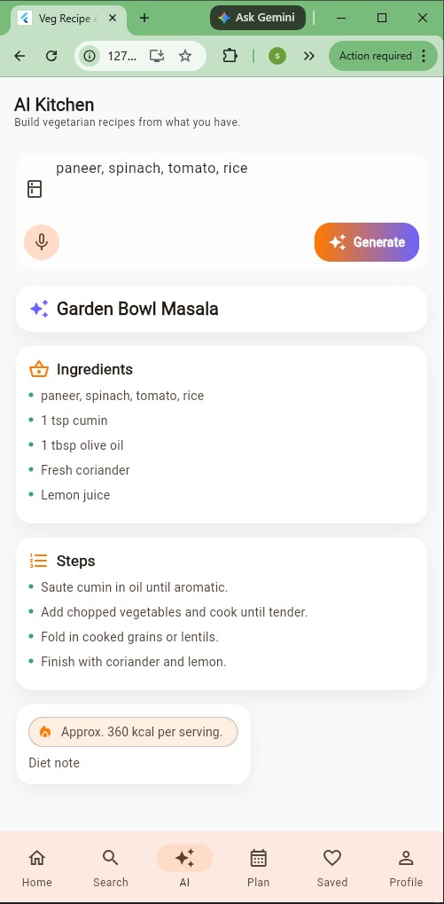
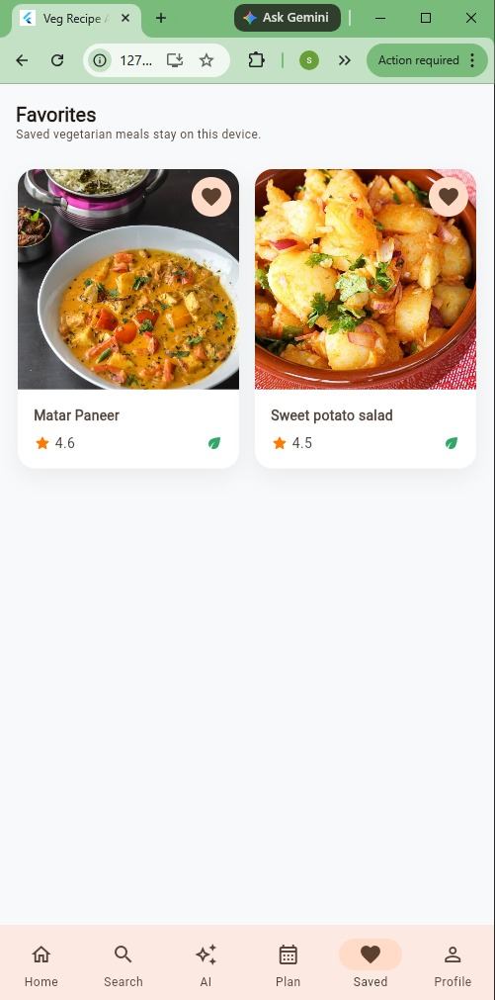
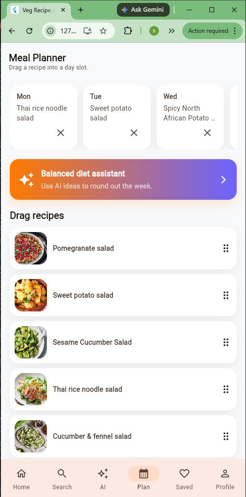
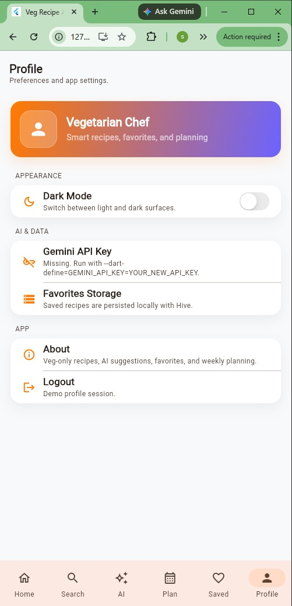
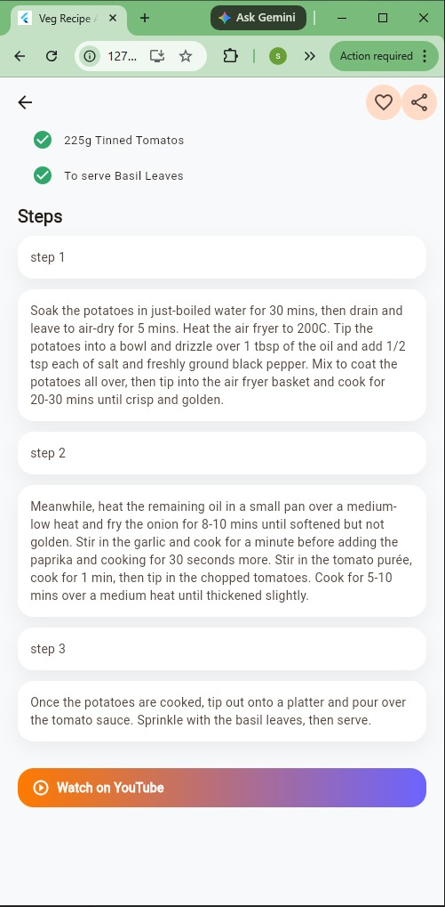

<div align="center">

# 🍽️ Veg Recipe AI App

### *Smart vegetarian cooking with AI-powered suggestions.*

[](https://flutter.dev)
[](https://dart.dev)
[](https://www.themealdb.com/)
[](https://ai.google.dev/)
[](https://riverpod.dev)

**A modern Flutter application that fetches vegetarian recipes from a REST API and generates smart AI-based recipes using Google Gemini.**

</div>

---

## 📖 Overview

The **Veg Recipe AI App** is a premium Flutter application built as part of the **Android Development Framework (ADF)** course.
It combines **REST API integration** and **AI-powered features** to provide a complete cooking experience.

Users can:

* Browse vegetarian recipes
* Search meals in real-time
* Save favorites
* Plan meals
* Generate recipes using AI

---

## ✨ Features

### 🔹 Core Features

* 🍽️ Fetch vegetarian recipes using REST API
* 🔍 Real-time search with debounce
* 📷 Recipe images with caching
* ❤️ Favorites system (local storage)
* 📺 YouTube cooking video integration

### 🤖 AI Features

* Generate recipes from ingredients
* Smart meal planning suggestions
* Voice input support
* AI fallback when API fails

### 🎨 UI / UX Features

* Apple-style smooth UI
* Light & Dark mode
* Glassmorphism cards
* Hero animations
* Shimmer loading effects

### ⚡ Advanced Features

* Drag & Drop Meal Planner
* Offline support (fallback recipes)
* Persistent storage using SharedPreferences
* Smooth navigation transitions

---

## 🛠️ Tech Stack

| Layer            | Technology           |
| ---------------- | -------------------- |
| Framework        | Flutter              |
| Language         | Dart                 |
| API              | TheMealDB            |
| AI               | Google Gemini        |
| State Management | Riverpod             |
| Storage          | SharedPreferences    |
| UI               | Material + Custom UI |

---

## 📱 App Screenshots

<div align="center">

### 🏠 Home Screen



---

### 🔍 Search Screen



---

### 🤖 AI Recipe Screen



---

### ❤️ Favorites Screen



---

### 📅 Meal Planner



---

### 👤 Profile Screen



---

### 📖 Recipe Detail



</div>

---

## 🧩 Project Structure

```
lib/
├── models/
├── repository/
├── services/
├── screens/
├── widgets/
└── main.dart
```

---

## ⚙️ Installation

```bash
git clone https://github.com/Kanani-Shubham/ADF_ALA-2_Recipe_Finder_App.git
cd recipefinder

flutter pub get
flutter run
```

---

## 🔐 API Setup (IMPORTANT)

Run app with Gemini API:

```bash
flutter run --dart-define=GEMINI_API_KEY=YOUR_API_KEY
```

---

## 🎯 Learning Outcomes

* REST API Integration
* JSON Parsing
* Repository Pattern
* State Management using Riverpod
* AI Integration (Gemini API)
* Flutter UI/UX Design

---

## 🔮 Future Improvements

* Firebase login system
* Recipe rating & comments
* AI nutrition tracking
* Voice assistant cooking mode

---

## 👨‍💻 Author

**Shubham Kanani**
Enrollment No: 20230905090053

---

<div align="center">

⭐ If you like this project, give it a star!

</div>
